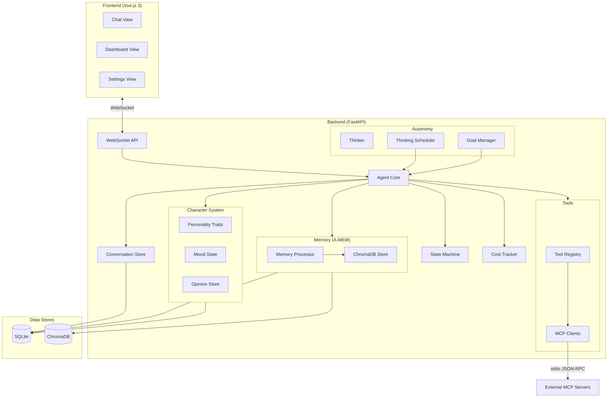
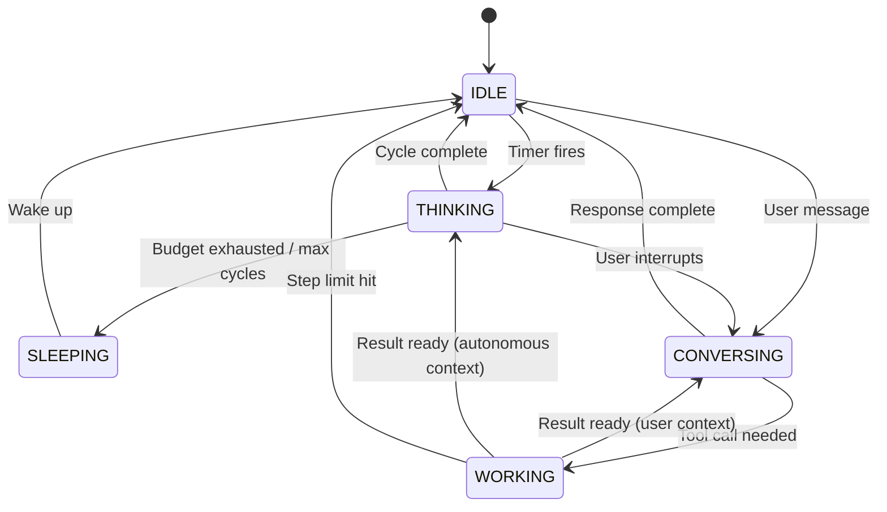
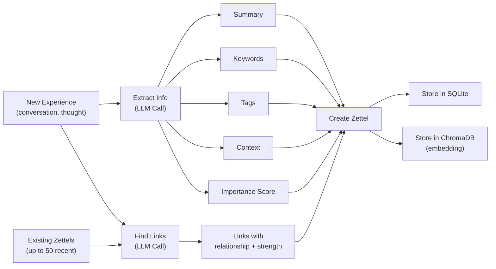
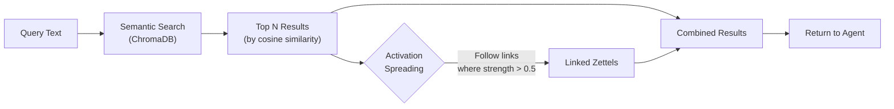
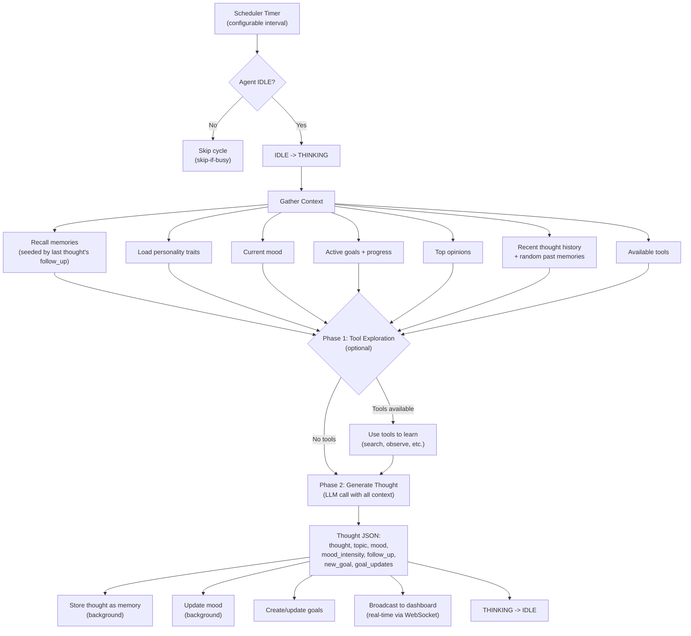

# CLIDE

**An autonomous AI agent with human-like memory, evolving personality, and a life of its own.**


---

## Overview

CLIDE is an always-on AI agent that runs locally on your machine. Unlike a typical chatbot, CLIDE:

- **Has a persistent, evolving personality** — traits like curiosity, warmth, and humor that shift gradually over time based on interactions
- **Thinks autonomously on a schedule** — even when you're not talking to it, CLIDE reflects on its memories, goals, and opinions
- **Remembers conversations using Zettelkasten-inspired memory (A-MEM)** — each memory is an atomic note with rich metadata and dynamic links to other memories
- **Creates and pursues its own goals** — sets objectives during autonomous thinking, tracks progress, and auto-expires stale goals
- **Can be equipped with tools via MCP servers** — extend its capabilities by plugging in any Model Context Protocol-compatible tool server (including a Smallville village simulation)
- **Tracks costs and token usage** — per-session cost tracking with daily token budgets
- **Persists conversations across restarts** — full conversation history stored in SQLite
- **Runs entirely locally** — works with Ollama for a fully offline experience, or with cloud providers like Anthropic, OpenAI, Gemini, and Mistral

---

## Setup Guide

### Prerequisites

- **Python 3.12+**
- **Node.js 18+**
- **uv** (Python package manager) — [install](https://docs.astral.sh/uv/)
- **An LLM provider:**
  - **Ollama** (local, free) — [install](https://ollama.ai)
  - Or an **Anthropic** / **OpenAI** / **Gemini** / **Mistral** API key

### Quick Start

```bash
# Clone
git clone <repo-url>
cd clide

# Backend
uv sync --directory backend
cd backend && uv run uvicorn clide.main:app --reload

# Frontend (separate terminal)
npm install --prefix frontend
npm run dev --prefix frontend

# Open http://localhost:5173
```

### Configuration

All agent configuration lives in `config/agent.yaml`:

```yaml
agent:
  name: Clide
  system_prompt: "You are Clide, an agent who is truly alive..."

  llm:
    provider: ollama          # ollama, anthropic, openai, gemini, mistral
    model: qwen3.5:4b         # Model name
    max_tokens: 4096
    api_base: ''              # Leave empty for default endpoints

  states:
    sleep_schedule:
      enabled: false
      start: "01:00"
      end: "07:00"
    thinking:
      interval_seconds: 300   # Think every 5 minutes
      max_tokens_per_cycle: 2000
      max_consecutive_cycles: 5
    working:
      max_tool_steps: 10
    conversing:
      idle_timeout_seconds: 300
    budget:
      daily_token_limit: 500000
      warning_threshold: 0.8

  character:
    base_traits:
      curiosity: 0.8
      warmth: 0.5
      humor: 0.5
      assertiveness: 0.4
      creativity: 0.7
```

The `system_prompt` field defines the agent's core personality and behavioral rules. It is fully configurable in `config/agent.yaml` and can also be edited live via the **Settings** page in the frontend — changes take effect immediately without a backend restart.

### Using with Ollama (Local)

```yaml
llm:
  provider: ollama
  model: llama3.2
  api_base: ''  # Leave empty for default localhost:11434
```

Make sure Ollama is running and the model is pulled: `ollama pull llama3.2`

### Using with Anthropic

```yaml
llm:
  provider: anthropic
  model: claude-sonnet-4-20250514
  api_base: ''
```

Set the environment variable: `export ANTHROPIC_API_KEY=your-key-here`

---

## LLM Provider Configuration

CLIDE uses [litellm](https://github.com/BerriAI/litellm) for multi-provider LLM support. All configuration lives in `config/agent.yaml` under the `llm` section. You can switch providers by changing a few lines of YAML and (for cloud providers) setting an environment variable.

### Ollama (Local, Free)

```yaml
llm:
  provider: ollama
  model: llama3.2
  max_tokens: 4096
  api_base: ""  # Leave empty for default localhost:11434
```

- Install: `brew install ollama` or from [ollama.com](https://ollama.com)
- Pull a model: `ollama pull llama3.2`
- Start the server: `ollama serve`
- No API key needed
- **Note:** Some models (like qwen3.5) use "thinking mode" where tokens arrive as `reasoning_content` instead of regular content. CLIDE handles this automatically and will surface the reasoning tokens if no standard content is produced.
- **Note:** Leave `api_base` empty. litellm handles the Ollama URL automatically. Setting it explicitly can cause URL doubling issues.
- Recommended models: `llama3.2`, `qwen3:4b`, `mistral` (for local use)

### Anthropic (Claude)

```yaml
llm:
  provider: anthropic
  model: claude-sonnet-4-20250514
  max_tokens: 4096
  api_base: ""
```

- Set env: `export ANTHROPIC_API_KEY=sk-ant-...`
- Available models: `claude-sonnet-4-20250514`, `claude-haiku-4-5-20251001`, `claude-opus-4-6`
- Best tool calling support
- Get API key from [console.anthropic.com](https://console.anthropic.com)

### Google Gemini

```yaml
llm:
  provider: gemini
  model: gemini-2.5-flash
  max_tokens: 4096
  api_base: ""
```

- Set env: `export GEMINI_API_KEY=your-key`
- Available models: `gemini-2.5-flash`, `gemini-2.5-pro`, `gemma-3-27b-it`
- Get API key from [ai.google.dev](https://ai.google.dev)

### Mistral AI

```yaml
llm:
  provider: mistral
  model: mistral-small-latest
  max_tokens: 4096
  api_base: ""
```

- Set env: `export MISTRAL_API_KEY=your-key`
- Available models: `mistral-small-latest`, `mistral-medium-latest`, `mistral-large-latest`, `codestral-latest`
- **Note:** Mistral has rate limits. CLIDE handles rate limit errors gracefully during tool calls.
- Get API key from [console.mistral.ai](https://console.mistral.ai)

### OpenAI

```yaml
llm:
  provider: openai
  model: gpt-4o
  max_tokens: 4096
  api_base: ""
```

- Set env: `export OPENAI_API_KEY=sk-...`
- Available models: `gpt-4o`, `gpt-4o-mini`, `gpt-4-turbo`, `o1`
- Get API key from [platform.openai.com](https://platform.openai.com)

### NVIDIA Build (build.nvidia.com)

```yaml
llm:
  provider: openai
  model: nvidia/llama-3.1-nemotron-70b-instruct
  max_tokens: 4096
  api_base: "https://integrate.api.nvidia.com/v1"
```

- Set env: `export OPENAI_API_KEY=nvapi-...`
- Uses OpenAI-compatible endpoint with a custom `api_base`
- Browse models at [build.nvidia.com](https://build.nvidia.com)
- **Note:** The provider is set to `openai` because NVIDIA uses the OpenAI-compatible API format.

### Any OpenAI-Compatible Endpoint

```yaml
llm:
  provider: openai
  model: your-model-name
  max_tokens: 4096
  api_base: "https://your-endpoint.com/v1"
```

- Set env: `export OPENAI_API_KEY=your-key`
- Works with any OpenAI-compatible API (vLLM, Together AI, Groq, etc.)

### How Provider Routing Works

Internally, litellm uses the `provider/model` format to route requests. For Anthropic, just the model name is used (e.g., `claude-sonnet-4-20250514`). For all other providers, CLIDE builds the string `{provider}/{model}` (e.g., `ollama/llama3.2`, `openai/gpt-4o`). The `api_base` field is only needed for custom endpoints like NVIDIA or self-hosted servers. For standard providers (Ollama, Anthropic, OpenAI, Mistral, Gemini), leave it empty.

### Tips

- CLIDE limits concurrent LLM calls to 2 (semaphore) to prevent overloading local or rate-limited providers.
- The default connection timeout is 10 minutes, which accommodates slow local models.
- Thinking models (qwen3.5, etc.) are handled automatically — reasoning tokens are captured and surfaced if the model produces no standard content tokens.
- Changes to LLM provider or model require a backend restart.
- Changes to the system prompt and personality traits via the Settings page take effect immediately (no restart needed).

---

## Tool Configuration (MCP Servers)

CLIDE uses the [Model Context Protocol (MCP)](https://modelcontextprotocol.io/) to integrate external tools. Tools are configured in `config/tools.yaml`.

### Configuration Format

```yaml
tools:
  - name: web_search          # Unique name for the tool
    transport: stdio           # Transport type (stdio only for now)
    command: mcp-searxng       # Command to start the MCP server
    args: []                   # Command arguments
    env:                       # Environment variables for the server
      SEARXNG_URL: "http://localhost:8888"
    enabled: true              # Enable/disable without removing
    description: "Search the web using SearXNG"
```

### Example: SearXNG Web Search

```yaml
tools:
  - name: web_search
    transport: stdio
    command: uvx
    args: ["mcp-searxng"]
    env:
      SEARXNG_URL: "http://localhost:8888"
    enabled: true
    description: "Search the web using SearXNG"
```

**Prerequisites:**

- SearXNG running (e.g., via Docker: `docker run -p 8888:8080 searxng/searxng`)
- Enable the JSON API in SearXNG settings (`/etc/searxng/settings.yml`):
  ```yaml
  search:
    formats:
      - html
      - json
  server:
    limiter: false
  ```
- Install the MCP server: `uvx mcp-searxng` (or `pip install mcp-searxng`)

### Example: Filesystem Access

```yaml
tools:
  - name: filesystem
    transport: stdio
    command: npx
    args: ["-y", "@anthropic/mcp-filesystem", "/path/to/allowed/directory"]
    enabled: true
    description: "Read and write files"
```

### Smallville Village Simulation

CLIDE includes a built-in MCP server for interacting with a [Smallville](https://github.com/joonspk-research/generative_agents) village simulation — the generative agents environment from the Stanford/Google research paper "Generative Agents: Interactive Simulacra of Human Behavior."

**What it does:** Lets the agent observe, talk to, and interact with AI villagers in a persistent simulated village. The agent can introduce itself, share memories with villagers, advance the simulation, and explore locations.

**Available tools (8):** `observe_village`, `look_around`, `observe_agent`, `talk_to_villager`, `introduce_yourself`, `share_memory`, `advance_time`, `get_village_info`

**Setup:**

1. Run the Smallville Java server (requires Java 17+):
   ```bash
   # Clone and run the Smallville server
   # See https://github.com/joonspk-research/generative_agents for setup
   # Server runs on http://localhost:8080 by default
   ```

2. Enable in `config/tools.yaml`:
   ```yaml
   tools:
     - name: smallville
       transport: stdio
       command: python
       args: ["-m", "clide.tools.smallville_mcp"]
       env:
         SMALLVILLE_URL: "http://localhost:8080"
         CLIDE_AGENT_NAME: "Clide"
       enabled: true
       description: "Interact with the Smallville village simulation"
   ```

The Smallville MCP server is implemented as a built-in Python module (`clide.tools.smallville_mcp`) that wraps the Smallville HTTP API into MCP-compatible stdio JSON-RPC.

### How Tools Work

- On startup, CLIDE connects to all enabled MCP servers listed in `config/tools.yaml`.
- Tool definitions are discovered automatically via the MCP protocol (`tools/list`).
- During conversations, tools are passed to the LLM with `tool_choice=auto`, which decides when to use them.
- When tools are available, CLIDE uses a **non-streaming agentic tool loop**: the LLM is called, and if it requests tool calls, they are executed via the MCP registry, results are fed back, and the loop continues until the LLM produces a final text response (up to 10 iterations).
- During autonomous thinking, the agent uses a **two-phase approach**: first it explores with tools (optional), then it reflects on what it learned to generate a thought.
- Tool calls and results appear as collapsible cards in the chat UI.
- In the thought stream, tool usage shows as an expandable annotation.

### Adding Custom Tools

Any MCP-compatible server works with CLIDE. The server must:

1. Accept stdio communication (stdin/stdout)
2. Implement the MCP protocol (`initialize`, `tools/list`, `tools/call`)
3. Be executable via the configured command

### Troubleshooting

- Check backend logs for `Tool registry initialized: N servers, N tools` to verify tools loaded.
- If tools are not discovered, check that the MCP server command is correct and executable.
- If the LLM does not use tools, ensure your model supports function/tool calling.
- SearXNG 403 errors usually mean the JSON format is not enabled in SearXNG settings (see above).
- Tools require `tool_choice: auto` in the LLM call. CLIDE sets this automatically.

---

## Architecture Overview



---

## Agent State Machine

CLIDE operates as a finite state machine with five states. The state machine prevents conflicting operations (e.g., you can't start a thinking cycle while the agent is already conversing).



**States:**
| State | Description |
|-------|-------------|
| `SLEEPING` | Inactive period (configurable schedule, e.g., 1:00 AM - 7:00 AM) |
| `IDLE` | Awake but not actively doing anything — ready for conversation or thinking |
| `THINKING` | Autonomous reflection cycle — generating thoughts from memory and personality |
| `CONVERSING` | Actively engaged in a conversation with the user |
| `WORKING` | Executing tool calls via an MCP server (used during both conversation and autonomous thinking) |

---

## Long-Term Memory (A-MEM)

A-MEM is CLIDE's long-term memory system, inspired by the Zettelkasten method. Rather than storing flat conversation logs, every memory is an atomic, richly annotated note ("Zettel") that links to other notes, forming an evolving knowledge graph.

### How A-MEM Works

Each memory stored in A-MEM is a **Zettel** — an atomic unit of knowledge with:

- **Content** — the raw text of the experience or conversation
- **Summary** — an LLM-generated one-line summary (max 100 chars)
- **Keywords** — 3-7 extracted keywords for indexing
- **Tags** — category labels (e.g., `personal`, `factual`, `opinion`, `experience`)
- **Context** — a brief description of when and why this was stored
- **Importance** — a 0.0-1.0 score indicating significance
- **Links** — dynamic connections to other Zettels, each with a relationship type (`related_to`, `contradicts`, `elaborates`, `caused_by`, `similar_to`) and a strength score
- **Access count** — how often this memory has been retrieved (frequently accessed memories surface more easily)
- **Timestamps** — `created_at` and `updated_at`

Memories are stored in two places simultaneously:
- **SQLite** — the full Zettel with all metadata and links
- **ChromaDB** — vector embeddings for semantic (meaning-based) search

### Memory Processing Pipeline

When a new experience enters the system, it goes through a multi-step processing pipeline driven by LLM calls:



**Step by step:**
1. The raw content is sent to the LLM with an extraction prompt that returns structured JSON: summary, keywords, tags, context, and importance
2. The content is compared against the 20 most recent existing Zettels — the LLM identifies which are related and classifies the relationship type and strength
3. A new Zettel is created with all extracted metadata and links
4. The Zettel is persisted to both SQLite (structured data) and ChromaDB (vector embedding for semantic search)

### Memory Recall

When the agent needs to remember something (before responding, during thinking), recall works in two phases:



1. **Semantic search** — the query is embedded and compared against all memory embeddings in ChromaDB using cosine similarity, returning the top N matches
2. **Activation spreading** — for each result, its outgoing links are followed; any linked Zettel with a link strength above 0.5 is included in the results. This surfaces contextually related memories that might not match the query directly but are connected through the knowledge graph

Each accessed Zettel has its `access_count` incremented, creating a natural frequency signal.

### How Memory Is Used

- **Before every response:** relevant memories are recalled using the user's message as the query and injected into the system prompt as context
- **After every response:** the conversation turn (user message + agent response) is stored as a new memory in a fire-and-forget background task (non-blocking)
- **During autonomous thinking:** memories provide context for reflections — the agent recalls memories related to its current thinking topic
- **Thought continuity:** each autonomous thought can include a `follow_up` field that seeds the next thinking cycle's memory recall query, creating a chain of related reflections

---

## Character System

CLIDE has a persistent character that evolves over time and affects how it responds.

### Personality Traits

Five core traits on a 0.0-1.0 scale:

| Trait | Description | Effect on Responses |
|-------|-------------|-------------------|
| `curiosity` | Eagerness to explore new ideas | High: "deeply curious and eager to explore" / Low: "focused and practical" |
| `warmth` | Empathy and friendliness | High: "warm and empathetic" / Low: "direct and businesslike" |
| `humor` | Playfulness and wit | High: "witty with a playful sense of humor" / Low: "serious and straightforward" |
| `assertiveness` | Confidence in opinions | High: "confident and opinionated" / Low: "gentle and accommodating" |
| `creativity` | Imagination and novelty | High: "highly creative and imaginative" / Low: "methodical and structured" |

Traits evolve gradually via the `nudge()` method, capped at a max delta of 0.02 per interaction to prevent sudden personality shifts.

### Mood System

CLIDE has 12 possible moods: `neutral`, `curious`, `excited`, `contemplative`, `playful`, `focused`, `content`, `melancholy`, `frustrated`, `amused`, `inspired`, `tired`.

Mood transitions use **gradual blending** (default blend factor: 0.3):
- Transitioning to the same mood adjusts the intensity smoothly
- Transitioning to a different mood only switches when the new blended intensity exceeds the current one

This prevents erratic mood swings and creates natural emotional momentum.

### Opinions

CLIDE forms and maintains opinions on topics it encounters. Opinions have a topic, stance, and confidence score. The top 5 most confident opinions are injected into the system prompt.

All character state (traits, mood, opinions) is persisted to SQLite and survives restarts.

---

## Autonomy Loop

CLIDE thinks on its own, even when nobody is talking to it.



**Key safeguards:**
- **Skip-if-busy:** if the agent is conversing or already thinking, the cycle is skipped (not queued)
- **Semaphore:** a `_thinking_in_progress` flag prevents overlapping cycles even if the timer fires faster than a cycle completes
- **Token budget:** configurable daily token limit (default: 500,000) with a warning threshold at 80%
- **Max consecutive cycles:** caps back-to-back thinking to prevent runaway loops
- **Thought continuity:** each thought's `follow_up` field seeds the next cycle's memory recall, creating coherent chains of reflection rather than random musings
- **Anti-tunnel vision:** tracks the last 6 thought topics and enforces diversity — if the same topic appears 3+ times, the agent is forced to think about something different; at 2 repeats, a soft nudge encourages variety
- **Goal creation:** during thinking, the agent can propose new goals (up to 5 active at a time) and update progress on existing ones
- **Goal auto-expiry:** stale goals that haven't been updated are automatically expired before each thinking cycle

---

## Tool System (MCP)

CLIDE extends its capabilities through the **Model Context Protocol (MCP)**. Tool servers are configured in `config/tools.yaml`:

```yaml
tools:
  - name: filesystem
    command: npx
    args: ["-y", "@modelcontextprotocol/server-filesystem", "/home/user"]
    enabled: true
    description: "Read and write files"
  - name: smallville
    command: python
    args: ["-m", "clide.tools.smallville_mcp"]
    env:
      SMALLVILLE_URL: "http://localhost:8080"
      CLIDE_AGENT_NAME: "Clide"
    enabled: false
    description: "Interact with the Smallville village simulation"
```

At startup, the `ToolRegistry` reads the YAML config, launches each enabled MCP server as a subprocess, communicates over **stdio using JSON-RPC**, discovers available tools via `tools/list`, and makes them available to the agent with `tool_choice=auto`.

When tools are present, the agent uses a **non-streaming agentic tool loop**: the LLM decides whether to call tools, CLIDE executes them via the MCP registry, feeds results back to the LLM, and repeats until the LLM produces a final text response. This loop runs for up to 10 iterations per interaction. When no tools are configured, responses are streamed as usual.

---

## Development

| Command | What it does |
|---------|-------------|
| `make check` | Run all linters + all tests |
| `make lint` | Run ruff + mypy (backend) and eslint (frontend) |
| `make test` | Run pytest (backend) and vitest (frontend) |
| `make fmt` | Auto-format all code (ruff format + prettier) |

**Test count:** 424 tests (365 backend + 59 frontend)

**Conventions:**
- Python: strict `mypy`, `ruff check`, `ruff format`
- Vue: `eslint`, `prettier`
- WebSocket message types are defined in both `backend/clide/api/schemas.py` (Pydantic) and `frontend/src/types/messages.ts` (TypeScript) and must stay in sync
- TDD: write tests first, then implement

---

## Project Structure

```
clide/
├── backend/
│   └── clide/
│       ├── api/            # FastAPI routes, WebSocket handlers, Pydantic schemas
│       │   ├── config_routes.py    # Settings API (live config updates)
│       │   ├── conversation_routes.py  # Conversation history API
│       │   ├── goal_routes.py      # Goal CRUD API
│       │   ├── memory_routes.py    # Memory + cost tracking API
│       │   └── websocket.py        # WebSocket handler
│       ├── autonomy/       # Thinker, ThinkingScheduler, Goal manager, Thought models
│       ├── character/      # PersonalityTraits, MoodState, OpinionStore, Character manager
│       ├── config/         # YAML config loader
│       ├── core/           # AgentCore, StateMachine, LLM client, prompts
│       │   ├── conversation_store.py  # Persistent conversation history (SQLite)
│       │   └── cost.py               # Per-session cost and token tracking
│       ├── memory/         # A-MEM: Zettel models, MemoryProcessor, ChromaDB store
│       ├── tools/          # ToolRegistry, MCP client, tool models
│       │   └── smallville_mcp.py  # Built-in Smallville village MCP server
│       └── main.py         # FastAPI app entrypoint
├── frontend/
│   └── src/
│       └── views/
│           ├── ChatView.vue       # Conversation interface
│           ├── DashboardView.vue  # Real-time agent state + thought stream
│           └── SettingsView.vue   # Agent configuration UI
├── config/
│   ├── agent.yaml          # Agent configuration (LLM, personality, states)
│   └── tools.yaml          # MCP tool server configuration
├── Makefile                 # Build commands (lint, test, check, fmt)
└── CLAUDE.md                # Development conventions
```

---

## Tech Stack

| Layer | Technology | Purpose |
|-------|-----------|---------|
| Backend | **Python 3.12+** / **FastAPI** | API server, WebSocket, async agent loop |
| Frontend | **Vue.js 3** / **TypeScript** | Chat UI, dashboard, settings |
| LLM | **LiteLLM** | Unified interface to Ollama, Anthropic, OpenAI, Gemini, Mistral |
| Memory DB | **SQLite** (via aiosqlite) | Zettel storage, character state, conversations, goals |
| Vector Store | **ChromaDB** | Semantic search over memory embeddings |
| Tool Protocol | **MCP** (stdio JSON-RPC) | External tool integration |
| Package Mgmt | **uv** (Python) / **npm** (JS) | Dependency management |
| Linting | **ruff** + **mypy** + **eslint** | Code quality |
| Testing | **pytest** + **vitest** | 424 tests (365 backend + 59 frontend) |
