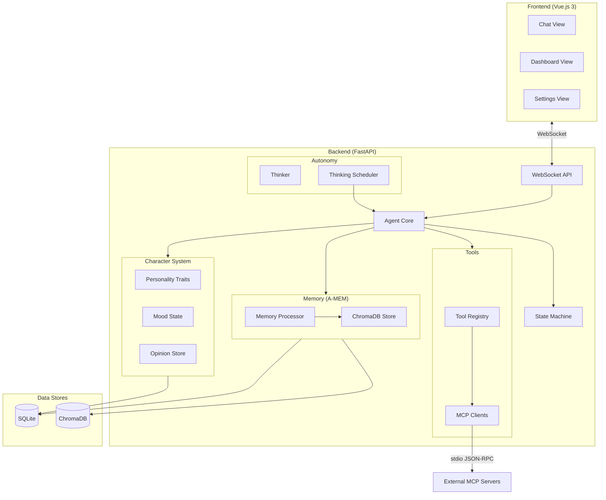
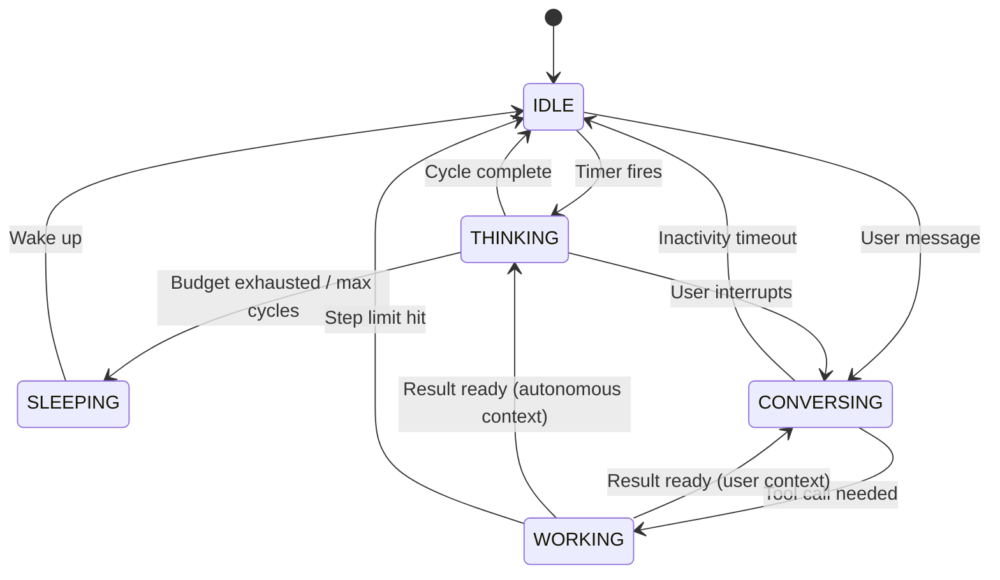
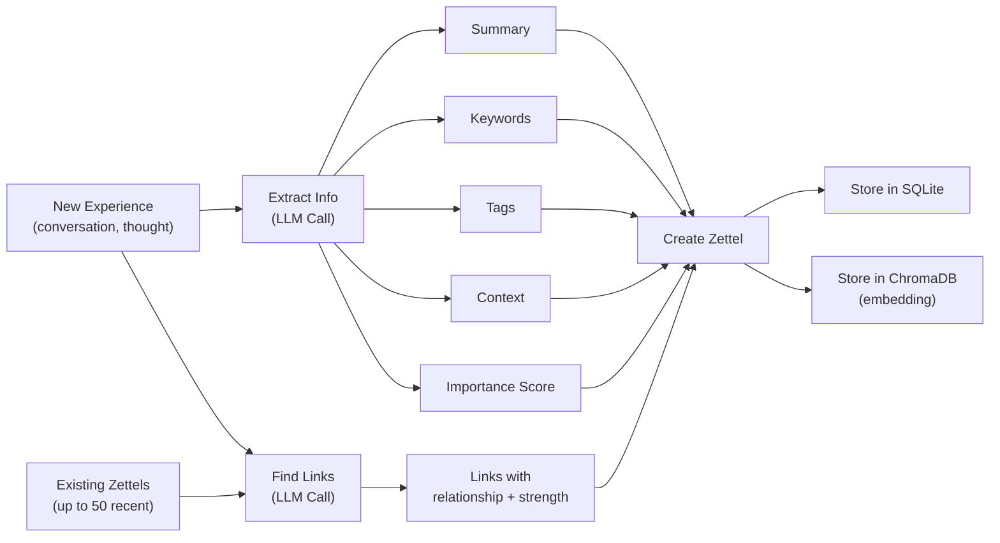
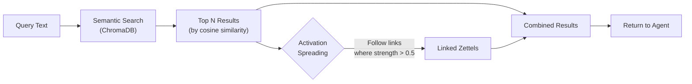
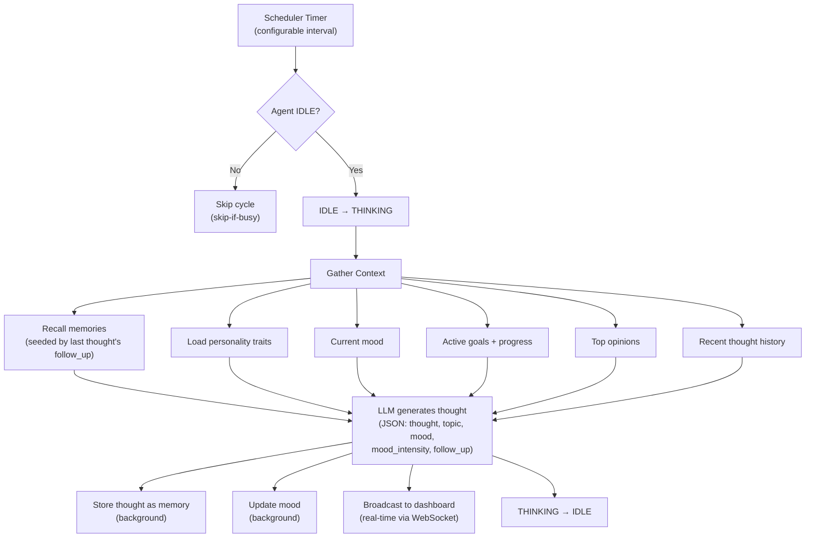

# CLIDE

**An autonomous AI agent with human-like memory, evolving personality, and a life of its own.**


---

## Overview

CLIDE is an always-on AI agent that runs locally on your machine. Unlike a typical chatbot, CLIDE:

- **Has a persistent, evolving personality** — traits like curiosity, warmth, and humor that shift gradually over time based on interactions
- **Thinks autonomously on a schedule** — even when you're not talking to it, CLIDE reflects on its memories, goals, and opinions
- **Remembers conversations using Zettelkasten-inspired memory (A-MEM)** — each memory is an atomic note with rich metadata and dynamic links to other memories
- **Can be equipped with tools via MCP servers** — extend its capabilities by plugging in any Model Context Protocol-compatible tool server
- **Runs entirely locally** — works with Ollama for a fully offline experience, or with cloud providers like Anthropic and OpenAI

---

## Architecture Overview



---

## Agent State Machine

CLIDE operates as a finite state machine with five states. The state machine prevents conflicting operations (e.g., you can't start a thinking cycle while the agent is already conversing).



**States:**
| State | Description |
|-------|-------------|
| `SLEEPING` | Inactive period (configurable schedule, e.g., 1:00 AM - 7:00 AM) |
| `IDLE` | Awake but not actively doing anything — ready for conversation or thinking |
| `THINKING` | Autonomous reflection cycle — generating thoughts from memory and personality |
| `CONVERSING` | Actively engaged in a conversation with the user |
| `WORKING` | Executing a tool call via an MCP server |

---

## Long-Term Memory (A-MEM)

A-MEM is CLIDE's long-term memory system, inspired by the Zettelkasten method. Rather than storing flat conversation logs, every memory is an atomic, richly annotated note ("Zettel") that links to other notes, forming an evolving knowledge graph.

### How A-MEM Works

Each memory stored in A-MEM is a **Zettel** — an atomic unit of knowledge with:

- **Content** — the raw text of the experience or conversation
- **Summary** — an LLM-generated one-line summary (max 100 chars)
- **Keywords** — 3-7 extracted keywords for indexing
- **Tags** — category labels (e.g., `personal`, `factual`, `opinion`, `experience`)
- **Context** — a brief description of when and why this was stored
- **Importance** — a 0.0-1.0 score indicating significance
- **Links** — dynamic connections to other Zettels, each with a relationship type (`related_to`, `contradicts`, `elaborates`, `caused_by`, `similar_to`) and a strength score
- **Access count** — how often this memory has been retrieved (frequently accessed memories surface more easily)
- **Timestamps** — `created_at` and `updated_at`

Memories are stored in two places simultaneously:
- **SQLite** — the full Zettel with all metadata and links
- **ChromaDB** — vector embeddings for semantic (meaning-based) search

### Memory Processing Pipeline

When a new experience enters the system, it goes through a multi-step processing pipeline driven by LLM calls:



**Step by step:**
1. The raw content is sent to the LLM with an extraction prompt that returns structured JSON: summary, keywords, tags, context, and importance
2. The content is compared against the 20 most recent existing Zettels — the LLM identifies which are related and classifies the relationship type and strength
3. A new Zettel is created with all extracted metadata and links
4. The Zettel is persisted to both SQLite (structured data) and ChromaDB (vector embedding for semantic search)

### Memory Recall

When the agent needs to remember something (before responding, during thinking), recall works in two phases:



1. **Semantic search** — the query is embedded and compared against all memory embeddings in ChromaDB using cosine similarity, returning the top N matches
2. **Activation spreading** — for each result, its outgoing links are followed; any linked Zettel with a link strength above 0.5 is included in the results. This surfaces contextually related memories that might not match the query directly but are connected through the knowledge graph

Each accessed Zettel has its `access_count` incremented, creating a natural frequency signal.

### How Memory Is Used

- **Before every response:** relevant memories are recalled using the user's message as the query and injected into the system prompt as context
- **After every response:** the conversation turn (user message + agent response) is stored as a new memory in a fire-and-forget background task (non-blocking)
- **During autonomous thinking:** memories provide context for reflections — the agent recalls memories related to its current thinking topic
- **Thought continuity:** each autonomous thought can include a `follow_up` field that seeds the next thinking cycle's memory recall query, creating a chain of related reflections

---

## Character System

CLIDE has a persistent character that evolves over time and affects how it responds.

### Personality Traits

Five core traits on a 0.0-1.0 scale:

| Trait | Description | Effect on Responses |
|-------|-------------|-------------------|
| `curiosity` | Eagerness to explore new ideas | High: "deeply curious and eager to explore" / Low: "focused and practical" |
| `warmth` | Empathy and friendliness | High: "warm and empathetic" / Low: "direct and businesslike" |
| `humor` | Playfulness and wit | High: "witty with a playful sense of humor" / Low: "serious and straightforward" |
| `assertiveness` | Confidence in opinions | High: "confident and opinionated" / Low: "gentle and accommodating" |
| `creativity` | Imagination and novelty | High: "highly creative and imaginative" / Low: "methodical and structured" |

Traits evolve gradually via the `nudge()` method, capped at a max delta of 0.02 per interaction to prevent sudden personality shifts.

### Mood System

CLIDE has 12 possible moods: `neutral`, `curious`, `excited`, `contemplative`, `playful`, `focused`, `content`, `melancholy`, `frustrated`, `amused`, `inspired`, `tired`.

Mood transitions use **gradual blending** (default blend factor: 0.3):
- Transitioning to the same mood adjusts the intensity smoothly
- Transitioning to a different mood only switches when the new blended intensity exceeds the current one

This prevents erratic mood swings and creates natural emotional momentum.

### Opinions

CLIDE forms and maintains opinions on topics it encounters. Opinions have a topic, stance, and confidence score. The top 5 most confident opinions are injected into the system prompt.

All character state (traits, mood, opinions) is persisted to SQLite and survives restarts.

---

## Autonomy Loop

CLIDE thinks on its own, even when nobody is talking to it.



**Key safeguards:**
- **Skip-if-busy:** if the agent is conversing or already thinking, the cycle is skipped (not queued)
- **Semaphore:** a `_thinking_in_progress` flag prevents overlapping cycles even if the timer fires faster than a cycle completes
- **Token budget:** configurable daily token limit (default: 500,000) with a warning threshold at 80%
- **Max consecutive cycles:** caps back-to-back thinking to prevent runaway loops
- **Thought continuity:** each thought's `follow_up` field seeds the next cycle's memory recall, creating coherent chains of reflection rather than random musings

---

## Tool System (MCP)

CLIDE extends its capabilities through the **Model Context Protocol (MCP)**. Tool servers are configured in `config/tools.yaml`:

```yaml
tools:
  - name: filesystem
    command: npx
    args: ["-y", "@modelcontextprotocol/server-filesystem", "/home/user"]
    enabled: true
    description: "Read and write files"
```

At startup, the `ToolRegistry` reads the YAML config, launches each MCP server as a subprocess, communicates over **stdio using JSON-RPC**, discovers available tools via `tools/list`, and makes them available to the agent. Tool definitions are formatted for LLM function calling.

---

## Setup Guide

### Prerequisites

- **Python 3.12+**
- **Node.js 18+**
- **uv** (Python package manager) — [install](https://docs.astral.sh/uv/)
- **An LLM provider:**
  - **Ollama** (local, free) — [install](https://ollama.ai)
  - Or an **Anthropic** / **OpenAI** API key

### Quick Start

```bash
# Clone
git clone <repo-url>
cd clide

# Backend
uv sync --directory backend
cd backend && uv run uvicorn clide.main:app --reload

# Frontend (separate terminal)
npm install --prefix frontend
npm run dev --prefix frontend

# Open http://localhost:5173
```

### Configuration

All agent configuration lives in `config/agent.yaml`:

```yaml
agent:
  name: Clide
  system_prompt: "You are Clide, an agent who is truly alive..."

  llm:
    provider: ollama          # ollama, anthropic, or openai
    model: qwen3.5:4b         # Model name
    max_tokens: 4096
    api_base: ''              # Leave empty for default endpoints

  states:
    sleep_schedule:
      enabled: false
      start: "01:00"
      end: "07:00"
    thinking:
      interval_seconds: 300   # Think every 5 minutes
      max_tokens_per_cycle: 2000
      max_consecutive_cycles: 5
    working:
      max_tool_steps: 10
    conversing:
      idle_timeout_seconds: 300
    budget:
      daily_token_limit: 500000
      warning_threshold: 0.8

  character:
    base_traits:
      curiosity: 0.8
      warmth: 0.5
      humor: 0.5
      assertiveness: 0.4
      creativity: 0.7
```

### Using with Ollama (Local)

```yaml
llm:
  provider: ollama
  model: llama3.2
  api_base: ''  # Leave empty for default localhost:11434
```

Make sure Ollama is running and the model is pulled: `ollama pull llama3.2`

### Using with Anthropic

```yaml
llm:
  provider: anthropic
  model: claude-sonnet-4-20250514
  api_base: ''
```

Set the environment variable: `export ANTHROPIC_API_KEY=your-key-here`

---

## Development

| Command | What it does |
|---------|-------------|
| `make check` | Run all linters + all tests |
| `make lint` | Run ruff + mypy (backend) and eslint (frontend) |
| `make test` | Run pytest (backend) and vitest (frontend) |
| `make fmt` | Auto-format all code (ruff format + prettier) |

**Test count:** 348 tests (299 backend + 49 frontend)

**Conventions:**
- Python: strict `mypy`, `ruff check`, `ruff format`
- Vue: `eslint`, `prettier`
- WebSocket message types are defined in both `backend/clide/api/schemas.py` (Pydantic) and `frontend/src/types/messages.ts` (TypeScript) and must stay in sync
- TDD: write tests first, then implement

---

## Project Structure

```
clide/
├── backend/
│   └── clide/
│       ├── api/            # FastAPI routes, WebSocket handlers, Pydantic schemas
│       ├── autonomy/       # Thinker, ThinkingScheduler, Goal manager, Thought models
│       ├── character/      # PersonalityTraits, MoodState, OpinionStore, Character manager
│       ├── config/         # YAML config loader
│       ├── core/           # AgentCore, StateMachine, LLM client, conversation store, prompts
│       ├── memory/         # A-MEM: Zettel models, MemoryProcessor, ChromaDB store
│       ├── tools/          # ToolRegistry, MCP client, tool models
│       └── main.py         # FastAPI app entrypoint
├── frontend/
│   └── src/
│       └── views/
│           ├── ChatView.vue       # Conversation interface
│           ├── DashboardView.vue  # Real-time agent state + thought stream
│           └── SettingsView.vue   # Agent configuration UI
├── config/
│   └── agent.yaml          # Agent configuration
├── Makefile                 # Build commands (lint, test, check, fmt)
└── CLAUDE.md                # Development conventions
```

---

## Tech Stack

| Layer | Technology | Purpose |
|-------|-----------|---------|
| Backend | **Python 3.12+** / **FastAPI** | API server, WebSocket, async agent loop |
| Frontend | **Vue.js 3** / **TypeScript** | Chat UI, dashboard, settings |
| LLM | **LiteLLM** | Unified interface to Ollama, Anthropic, OpenAI |
| Memory DB | **SQLite** (via aiosqlite) | Zettel storage, character state, conversations |
| Vector Store | **ChromaDB** | Semantic search over memory embeddings |
| Tool Protocol | **MCP** (stdio JSON-RPC) | External tool integration |
| Package Mgmt | **uv** (Python) / **npm** (JS) | Dependency management |
| Linting | **ruff** + **mypy** + **eslint** | Code quality |
| Testing | **pytest** + **vitest** | Backend + frontend tests |
